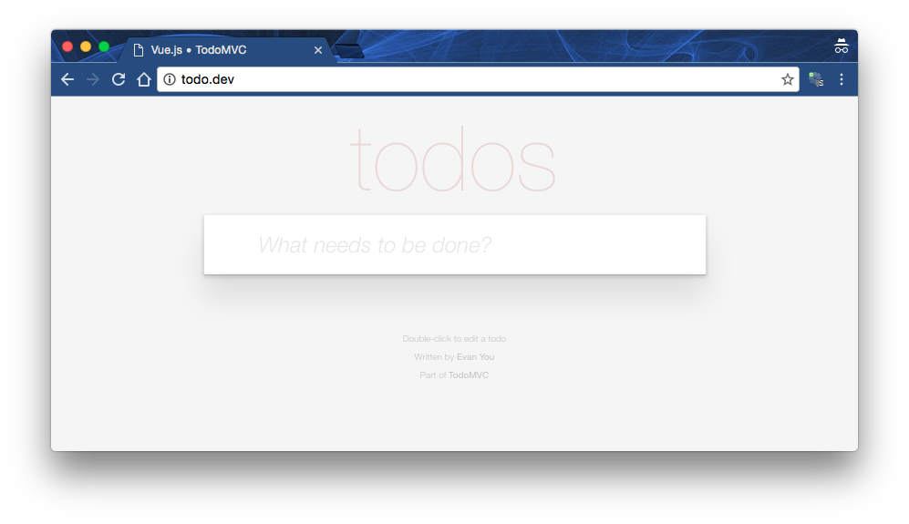

# Todo application testin using Selenium.
Demonstration of Selenium using php-webdriver by Facebook on top of PHPUnit.

## Prerequisites
Make sure your server (computer) meets the following requirements:

 - PHP >= 5.6.4 (server (`apache2` or `nginx`) is **not required**)
 - composer (how to install [guide](https://getcomposer.org/doc/00-intro.md#installation-linux-unix-osx))
 - npm (how to install [guide](https://docs.npmjs.com/getting-started/installing-node))
 - [selenium-standalone-server 3.0.1 [~20MB]](http://selenium-release.storage.googleapis.com/index.html?path=3.0/)
 - browser specific drivers (whole list can be found [here](http://www.seleniumhq.org/download/) in section *Third Party Browser Drivers*)
    - [chromedriver](https://sites.google.com/a/chromium.org/chromedriver/) - Google Chrome
    - [geckodriver](https://github.com/mozilla/geckodriver/releases) - Mozilla Firefox
    - [safaridriver](https://github.com/SeleniumHQ/selenium/wiki/SafariDriver) - Safari
    - [edgedriver](https://developer.microsoft.com/en-us/microsoft-edge/tools/webdriver/) - Microsoft Edge
    - [operadriver](https://github.com/operasoftware/operachromiumdriver) - Opera

>**Note**: I tested this working example only with **chromedriver**
>**Note**: on Mac OS you can install **selenium-standalone-server** (and some drivers) using [homebrew](http://brew.sh/index.html)
```
brew install selenium-server-standalone
brew install chromedriver
```

## Installation && setup

 - install php dependencies using composer
 - install Todo application using npm

    In terminal change working directory to `./application` and run following:

    ```
    composer install
    composer dump-autoload -o
    npm install
    ```
 - serve `./application/index.html`; two options are available (remember which one you used)
    - set up server and serve using virtual-host
    - use `file:///<path to application folder>/index.html`
 - manually test working Todo application you should see following:



>**Note**: I am using apache2 and vhost to serve static page on local domain *todo.dev*

After package managers install all required software you are ready to use example code.

## Usage / running
Change `$url` variable on [TodoAppTest.php on line 11](https://github.com/Kyslik/asos-selenium/blob/master/application/tests/TodoApp/TodoAppTest.php#L11) to reflect path to Todo application.

Open up two terminal windows (or tabs), one is going to be used for **selenium-standalone-server** (tab A) and second one is going to be used for **PHPUnit** (tab B).  

 - in tab A start **selenium-standalone-server** on port 4444 (default), to do so run following:
 ```
 java -jar <path_to>/selenium-server-standalone-<version>.jar
 ```
 >**Note**: on Mac OS if you used homebrew to install selenium-standalone-server you can run following:
 ```
 selenium-server -port 4444
 ```

 - in tab B change working directory to `./application` and simply run `vendor/bin/phpunit`

### Brief explanation
In tab A you can monitor what exactly is PHPUnit invoking while test is beeing run (kind of selenium log). 
In tab B you may observe execution of PHPUnit test suite located in `./application/tests/TodoApp`. 

On the background PHPUnit invokes selenium-standalone-server with some rules/patterns and selenium-standalone-server translates it to (in this case) chromedriver API.
